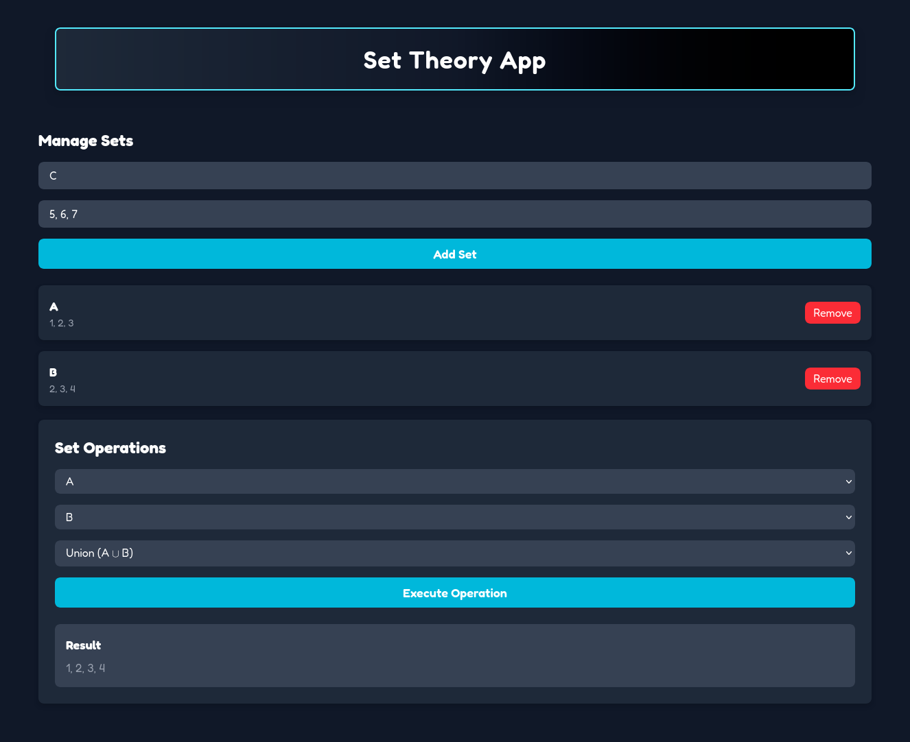

# 📐 Set Theory App


[🇪🇸 Version en español](README.es.md)

**Set Theory App** is an interactive web application that allows users to **create, visualize, and perform operations on mathematical sets**. Ideal for students, educators, or enthusiasts of set theory, this app offers an intuitive interface to explore operations such as union, intersection, difference, and more.

---



---

## 📚 Table of contents

- [What does this app do?](#-what-does-this-app-do)
- [Technologies used](#-technologies-used)
- [How to run the project](#-how-to-run-the-project)
- [How to contribute](#-how-to-contribute)
- [Contact me](#-contact-me)

---

## 🧠 What does this app do?

With **Set Theory App**, you can:

- ✏️ Input custom sets (e.g.: A = {1, 2, 3}, B = {2, 3, 4})
- ⚙️ Perform operations between sets:
  - Union (A ∪ B)
  - Intersection (A ∩ B)
  - Difference (A - B)
  - Symmetric Difference (A Δ B)
  - Complement (¬A)
  - Cartesian Product (A × B)
  - Power Set (P(A))
- 👁️ View results clearly and neatly

---

## 🧱 Technologies used

### 🖥️ Frontend

- [React](https://reactjs.org/)
- [Vite](https://vitejs.dev/)
- [Tailwind CSS](https://tailwindcss.com/)

### ⚙️ Backend

- [Python](https://www.python.org/)
- [FastAPI](https://fastapi.tiangolo.com/)
- [Pydantic](https://pydantic-docs.helpmanual.io/)
- [Uvicorn](https://www.uvicorn.org/)

---

## 🚀 How to run the project

### 🧩 Requirements

- Node.js (v18 or higher)
- Python (v3.8 or higher)
- pip (v20 or higher)
- npm/yarn (your choice)

### 1. Clone the repository

```bash
git clone https://github.com/blandoncj/SetTheoryApp.git
cd SetTheoryApp
```

### 2. Install dependencies

🔹Frontend

```bash
cd frontend
npm install # or yarn install
npm run dev # or yarn dev
```

🔹 Backend

```bash
cd backend
python -m venv env
source venv/bin/activate # On Windows: venv\Scripts\activate
pip install -r requirements.txt
python main.py
```

### 3. Open the app

Once both servers are running, open your browser and go to:

- <http://localhost:5173> (Frontend)
- <http://localhost:8000> (Backend)

---

## 🤝 How to contribute

Contributions are welcome! Just follow these steps:

1. Fork the repository.
2. Create a branch (git checkout -b feature/your-feature or fix/your-fix).
3. Make your changes and commit (git commit -m 'Added new feature').
4. Push to your fork (git push origin feature/your-feature).
5. Open a Pull Request.

## 💬 Contact me

If you have questions, suggestions, or want to talk about set theory:

- Email: <jacoboblandon94@gmail.com>
- GitHub: [blandoncj](https://githbu.com/blandoncj)
